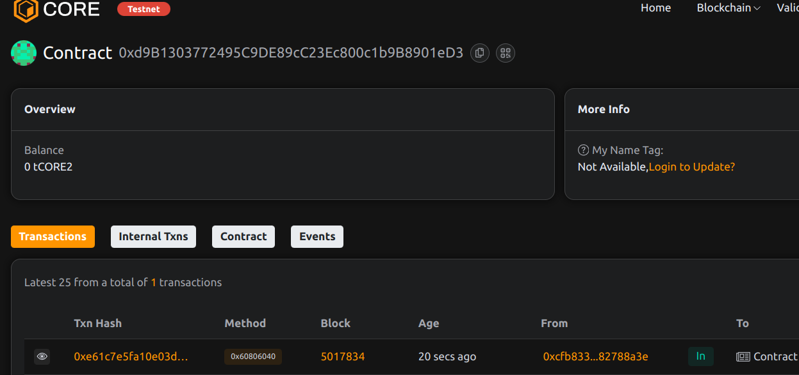

# Project Title: SaveNFT: Cross-Game Progression via NFTs

## Project Description

SaveNFT is a smart contract that represents player progression as NFTs. Each NFT contains the game name and progress data, allowing cross-game continuity and interoperability.

## Project Vision

To create portable player profiles and save files across blockchain games, enabling interoperability and persistent game identity.

## Key Features

- Mint NFTs as game save profiles
- On-chain progress updates by authorized game contracts
- Player-controlled authorization of external game engines
- Open data for cross-game use and reputation systems

## Future Scope

- Encrypted save data with zero-knowledge updates
- Game DAO oracles to verify progress
- Inter-game achievements and transferable stats
- Integration with wallet-based gamer identities

## Contract Details
0xd9B1303772495C9DE89cC23Ec800c1b9B8901eD3
 
